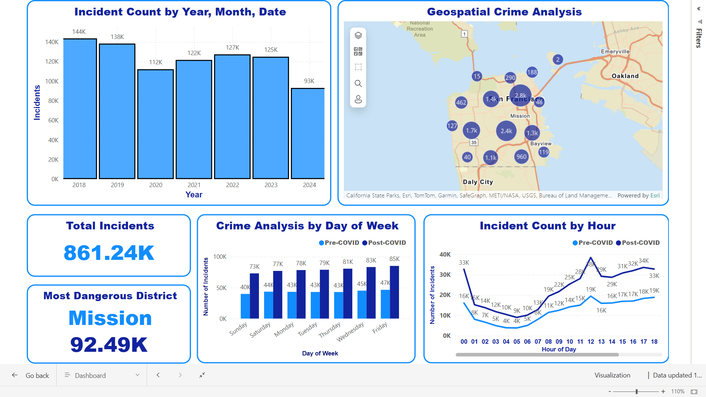

# San Francisco Crime Pattern Analysis

This repository contains the project "San Francisco Crime Pattern Analysis," which investigates crime patterns in San Francisco using data analytics and visualization tools. The project integrates historical and real-time data to analyze temporal trends, geographic crime distributions, and resolution effectiveness.

## Overview

This project utilizes the following tools and technologies:
- **Snowflake**: Data warehousing and storage.
- **Airflow**: Automating ETL workflows with Directed Acyclic Graphs (DAGs).
- **dbt (Data Build Tool)**: Transforming data for analysis.
- **Power BI**: Interactive dashboards and visualizations.

Key findings include:
- Noticeable crime trends during summer months.
- Spatial clustering of crimes in high-density areas.
- Doubling of crime incidents post-COVID.

## Features

1. **Data Pipeline**: 
   - Extract historical and real-time data.
   - Transform and clean data using dbt.
   - Automate workflows with Airflow.

2. **Visualization**:
   - Crime heatmaps and trend analysis in Power BI.
   - Temporal and spatial insights into crime distribution.

3. **Incremental Updates**:
   - Efficiently handle new data using datetime-based updates.

## Project Structure

-.
-├── dags/
-│   ├── Historical_upload_ETL.py
-│   ├── API_ETL.py
-├── dbt/
-│   ├── models/
-│   ├── snapshots/
-├── reports/
-│   ├── Project_Report.pdf
-├── images/
-│   ├── PowerBI_dashboard.png
-│   ├── DAG_overview.png
-│   ├── dbt_visualization.png
-│   ├── Heatmap_visualization.png
-├── README.md


## Workflow Overview

### Data Pipeline


- **Airflow** automates data ingestion from the San Francisco Open Data Portal.
- **dbt** transforms raw data for insights and analytics.
- Data is stored and processed in **Snowflake**.

### Visualizations


- Interactive dashboards provide insights into crime patterns.
- Geographic heatmaps and temporal graphs highlight crime clusters and trends.

### Data Processing


- dbt handles data aggregation and quality checks.
- Outputs structured datasets ready for visualization.

## Results

### Crime Heatmap


- Highlights crime hotspots across San Francisco.

### Key Metrics:
- Over 861,000 crime incidents analyzed.
- Most dangerous district: Mission with 92,490 incidents.

## Usage

1. Clone the repository:
   ```bash
   git clone https://github.com/username/san-francisco-crime-analysis.git
   cd san-francisco-crime-analysis

### 2. Install dependencies:
- pip install -r requirements.txt
  
### 3.Set up Airflow:
- airflow db init
- airflow scheduler
- airflow webserver
  
### 4. Load data into Snowflake and run dbt transformations.
### 5. Access visualizations in Power BI.

# Authors
- Yashwanth Reddy Katipally
- Pranav Reddy Gaddam
- Anvay Bhanap
- Thejes Raj Gangadhar
